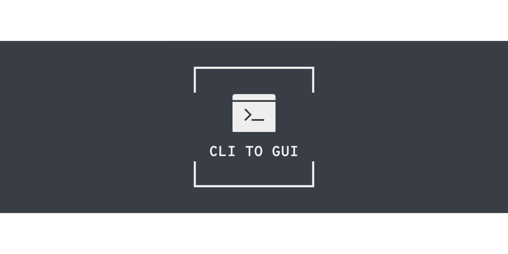

# CLI TO GUI (CTG)
This tool is for management framework projects by GUI instead of CLI.
You could import some projects and manage them.

## CLI TO GUI uses
- [ElectronJs](https://www.electronjs.org/) + [Vue3](https://vuejs.org/)
- [Element Plus](https://element-plus.org/)
- [Remix Icon](https://remixicon.com/)

# Coming Features
### Backend Frameworks
- [x] Laravel ([Php Artisan](https://laravel.com/docs/10.x/artisan))
- [ ] Django ([Django Admin](https://docs.djangoproject.com/en/4.1/ref/django-admin/))
- [ ] Ruby On Rails ([The Rails Command Line](https://guides.rubyonrails.org/command_line.html))
- [ ] Other frameworks

### Frontend Frameworks
- [ ] Vue ([Vue CLI](https://cli.vuejs.org/))
- [ ] React ([Create React App](https://create-react-app.dev/))
- [ ] Angular ([Angular CLI](https://angular.io/cli))
- [ ] Other frameworks

### Other
- [ ] Ability to create custom scripts for every projects
- [ ] Ability to connect to remote workspaces
 
# To do
- Laravel ([Php Artisan](https://laravel.com/docs/10.x/artisan)) :construction:
